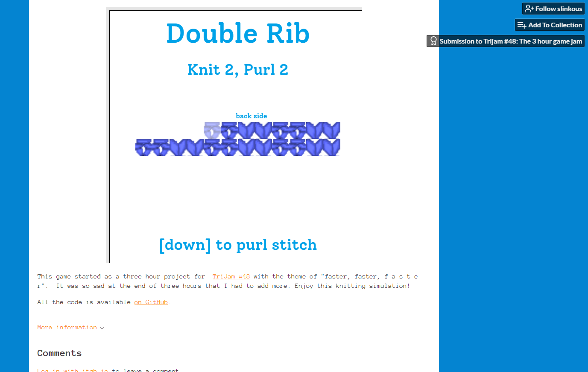

# Speed Swatch Simulator

## Summary
This game began as a submission to [TriJam #48](https://itch.io/jam/trijam-48) under the theme "Faster... Faster... F A S T E R". It has been developed considerably beyond the original three hours.

It is written entirely using the Canvas API and vanilla JavaScript.

## Art

Created by me and available on [Piskel](https://www.piskelapp.com/user/6435927814569984/public)

## Play

[Play on itch.io](https://slinkous.itch.io/speed-swatch-simulator)
